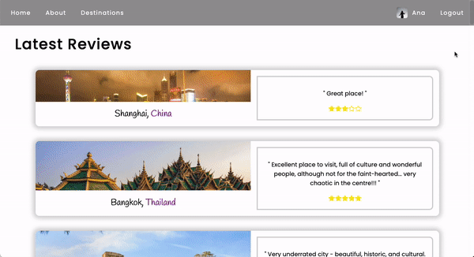
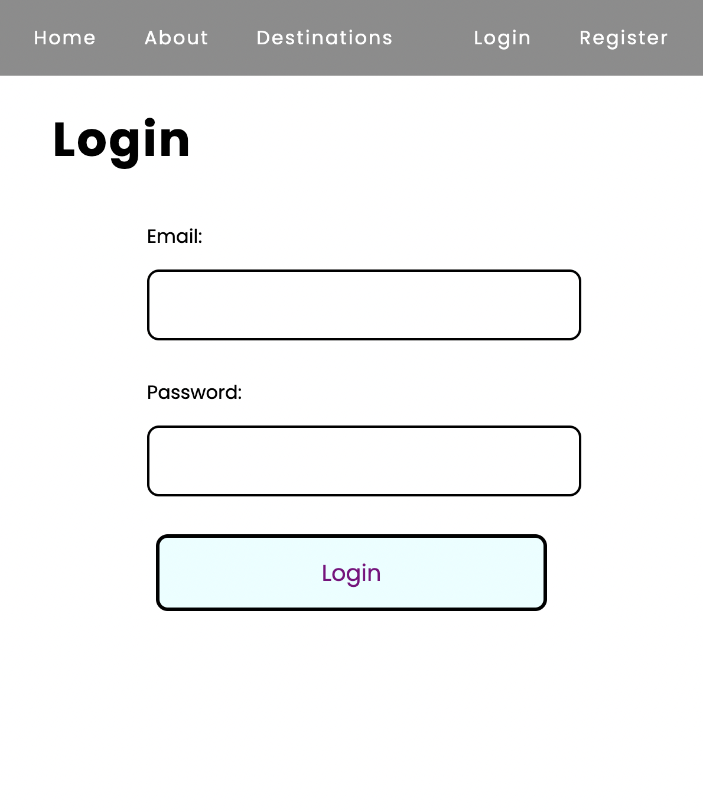
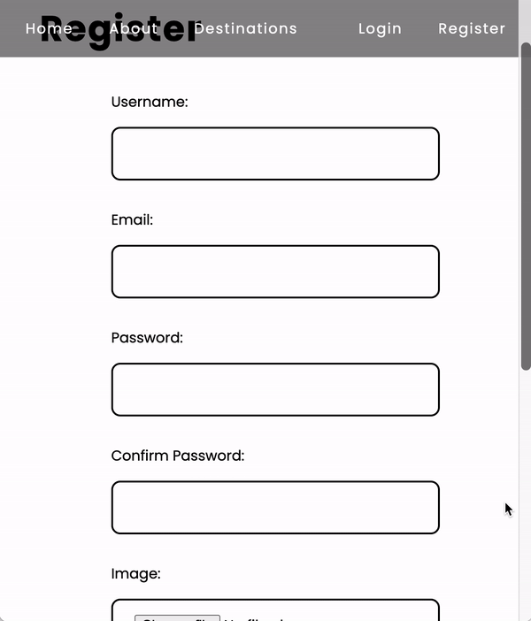
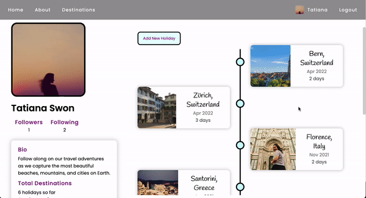
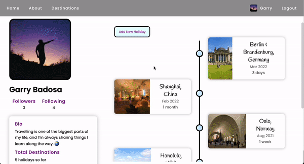
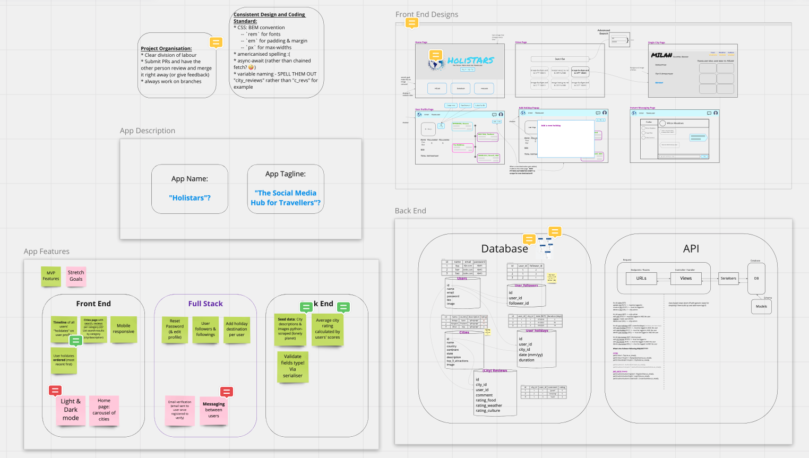
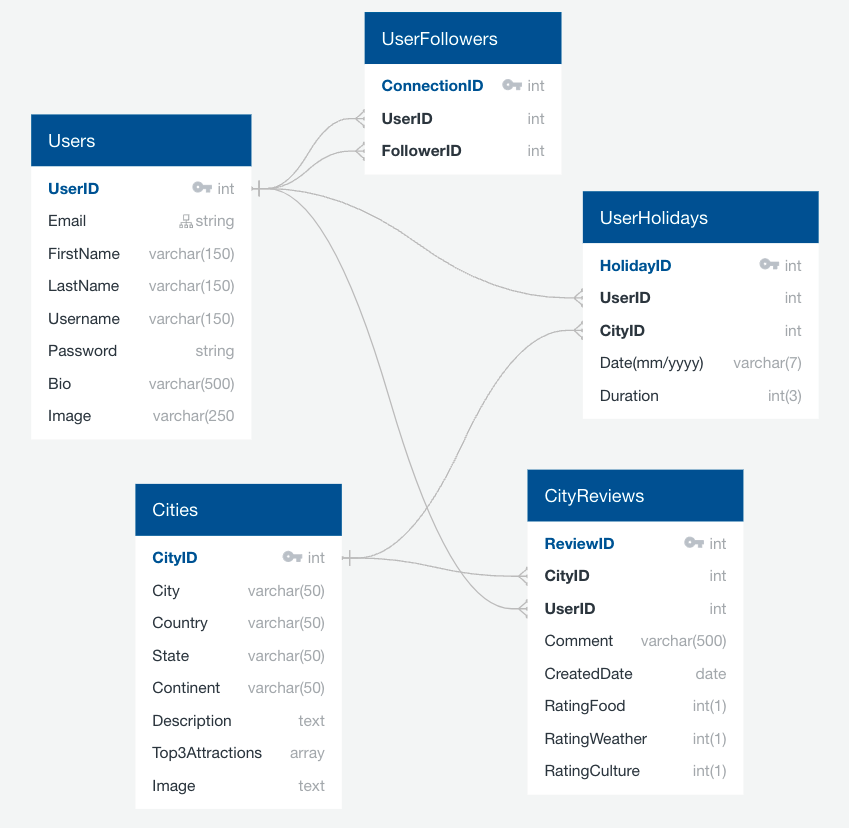

# Holistars
A full stack social media app for travellers that lets users browse destinations, read & leave reviews, follow other travellers, and create a timeline of their own holidays.
This project was created by Emily Daykin and Marco Manunta in the span of around 10 days. For a full list of this app's features, see the [Features](#features) section below.

**This repo contains code for the front end client only; code for the back end api lives [here](https://github.com/frozenborder72/holistars-api).**


## Installation
- Check out the live application [here](https://holistars-099f3e.netlify.app/)!
- Or run it locally (from root level of directory):
  - Server: `pipenv shell` &#8594; `pipenv install` &#8594; `python manage.py migrate` &#8594; `python manage.py loaddata data/seed_<table>.json` (for table in 'users', 'cities', 'holidays', 'reviews', 'followers') &#8594; `python manage.py runserver`
  - Client: `npm install` &#8594; `npm start`

## Application Walkthrough
### Home Page (Authenticated = Welcome Page; Unauthenticated = News Feed)
<p align="center">
  
  
</p>

### About, Login & Register Pages
<p align="center">
  
  
  
</p>

### Destinations 
<p align="center">
  
</p>

### Personal Profile Page
<p align="center">
  
</p>

### Single City
<p align="center">
  
</p>

### Dynamically Scrape Holiday Destination
<p align="center">
  
</p>


## Tech Stack
### Front End
- React.js Framework (Single Page Application)
- Redux
- API Handling: Axios
- Pure CSS with Sass
- React-Router-Dom

### Back End
- Server: Django & Django Rest Framework
- Database: PostgreSQL
- Authentication: JSON Web Token (pyJWT)
- Scraping: Python & Beautiful Soup

### Collaboration & Development
- Git, GitHub
- Trello (project management)
- Postman (API testing)
- Miro (wireframing, planning)
- Npm & Pipenv
- Deployment:
  - Front End: Netlify
  - Back End: Heroku

## Features
- Display of all destinations, and routing to an individual city page with descriptions, top attractions, reviews and travellers
- Real time searching through all destinations by city, country, description or top attractions
- Average rating (over food, weather and culture categories) of each destination shown (created by a python property decorator in the Django model)
- Log In, Register and Log Out functionality
- Once logged in, the user can:
  - View a news feed on their home page which orders recently-reviewed/rated destinations
  - Redirect to their profile page via an icon & name that appear immediately in the navbar
  - Add a holiday to their profile timeline
  - Dynamically scrape for a holiday destination if not listed in database, then add it to the database
  - Leave a review for a destination and rate it (by food, weather and culture).
  - Follow other travellers

## Planning & Wireframing:
### Whiteboarding:
<p align="center">
  
</p>

### Entity Relationship Diagram (ERD via QuickDBD)
<p align="center">
  
</p>

## Architecture:
### Front End: 
- React Components to compartmentalise code
- Redux-Toolkit to manage state across the entire application
- React Hooks for component state management and handling side effects
- SASS and Block-Element-Modifier (BEM) methodology
- Single Page Application (`react-router-dom`) using `Link`, `useNavigate`, `useLocation` and `useParams`
### Back End:
- 5 tables/models in PostgreSQL, only one-to-many relationships 
- All security checks (user access credentials) done in Django in the back end:
  - Email validation
  - Password encryption
  - Obscuring the password response in the database and from the client side
  - Login credentials expire after 1 day
- Data seeding of 15 user profiles, 32 pre-scraped cities, 39 holidays, 33 reviews and 9 following-follower relationships.


## Featured Code Snippets
### Front End
#### Combining Redux-Toolkit and React useState & useEffect hooks to manage the display of all vs searched cities
```
const allCitiesRedux = useSelector(selectAllCities);
const [cities, setCities] = useState(null);

const getCityAvgRating = (city) =>
  city.reviews.reduce((total, review) => total + review.avg_rating, 0) / city.reviews.length;

useEffect(() => {
  const getCityData = async () => {
    const allCities = await getAllCities();
    const shuffledCities = allCities.sort(() => 0.5 - Math.random());
    setCities(shuffledCities);
  };
  getCityData();
}, []);

const filterThroughCities = async (searchInput) => {
  if (searchInput) {
    const filteredCities = await searchCities(searchInput);
    setCities(filteredCities);
  } else {
    setCities(allCitiesRedux);
  }
};

const handleSearchChange = (e) => {
  filterThroughCities(e.target.value);
};
```

### Back End
#### The follower-following relationship between users is an intermediary table of 'User Followers' in the database structure
```
from django.db import models
from django.contrib.auth import get_user_model

User = get_user_model()

class Follower(models.Model):
    """ Followers table:
            - user = the person being followed (target)
            - follower = the user following the user
    """
    user = models.ForeignKey(User, related_name='followers',
                             on_delete=models.SET_NULL, null=True)
    follower = models.ForeignKey(User, related_name='followings',
                                 on_delete=models.SET_NULL, null=True)

    def __str__(self):
        return f'{self.follower} is following {self.user}'
```

#### Dynamically scraping Lonely Planet's search results based on users' search input ('city' & 'country') in the app
```
import requests
from unidecode import unidecode
from bs4 import BeautifulSoup


def search_lonely_planet(city_name, country_name):
    """ This function takes the POST request `{{baseURL}}/scrape/search/` data 
        when a new destination is searched, and returns a valid Lonely Planet URL.
    """

    city_name = unidecode(city_name.lower())
    country_name = unidecode(country_name.lower())

    if requests.get(f'https://www.lonelyplanet.com/{country_name}/{city_name}').status_code == 200:
        city_url_to_scrape = f'https://www.lonelyplanet.com/{country_name}/{city_name}'
        return [city_url_to_scrape]

    # If city URL on lonely-planet isn't as straighforward, SEARCH the site:

    # Bypassing Response [403] with headers:
    header = {
        "user-agent": "Mozilla/5.0 (Windows NT 10.0; Win64; x64) AppleWebKit/537.36 (KHTML, like Gecko) Chrome/74.0.3729.169 Safari/537.36",
        'referer': 'https://www.google.com/'
    }

    page = requests.get(
        f'https://www.lonelyplanet.com/search?q={city_name}', headers=header)
    soup = BeautifulSoup(page.content, 'html.parser')

    search_results = soup.find_all(
        'a', class_='jsx-1866906973 ListItemTitleLink')
    if len(search_results) == 0:
        return ''
    else:
        cities_urls_to_scrape = []
        for result in search_results:
            if (unidecode(result['href'].split('/')[0]) == country_name):
                cities_urls_to_scrape.append(
                    f"https://www.lonelyplanet.com/{result['href']}")

        return cities_urls_to_scrape
```


## Wins & Challenges

## Future Improvements